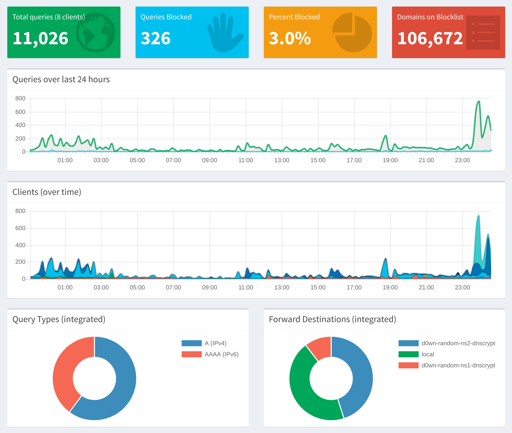
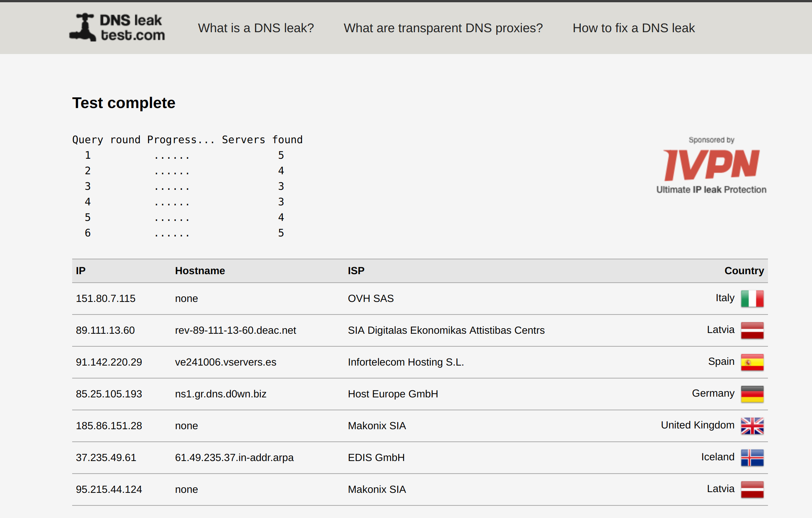
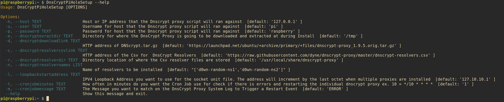

# DnsCryptPiHoleSetup

DnsCryptPiHoleSetup is a command line tool to set up Dnscrypt Proxies on PiHole for Raspberry Pi 3.

This tool is meant to be a all in one solution to manage and build your DNS proxies. If you do not like a setup you have configured you can rerun the tool to install new Dns Crypt proxies with no repercussions.

## Features

- Installs Dnscrypt software if it doesn't existing.
- Builds Socket and Service Files for your DNS Crypt based on the resolvers name. 
- Edits the PiHole Configuration and restarts the DnsMasq Service
- Montors DnsCrypt Proxies and restarts the individual proxy that have shown a error in the last 10 mins.

## Getting Started

`sudo apt-get install python3-pip`
#### Note: if you do not use Sudo it will install to the `/home/{username}/.local/bin` which is not available by as a path in Raspbian Strech. Sudo will install the command in `/usr/local/bin/DnsCryptPiHoleSetup`. This make it globally available.
`sudo pip3 installDnsCryptPiHoleSetup`

### Run the command
##### note: this will setup d0wn-random-ns1 and d0wn-random-ns2 by default which randomized each querie across 18 different servers.
`DnsCryptPiHoleSetup`
From here you will see a bunch of output from linux commands so you can track what is going on.

When it is finish you will see `DNS crypt Setup has Ran Successfully`
It best to Flush you logs after running this so it accurate remove old information in the pi hole GUI

### Test your configuration
#### Note: this output is from the default setup

[DnsLeakTest](https://www.dnsleaktest.com/)

### Get Stuck? Use Show the help menu

#### Example of the default config with command options

`DnsCryptPiHoleSetup -h '127.0.0.1' -u 'pi' -p 'raspberry' -e '/tmp' \
 -d 'https://launchpad.net/ubuntu/+archive/primary/+files/dnscrypt-proxy_1.9.5.orig.tar.gz' \
 -r '/usr/local/share/dnscrypt-proxy' -n "['d0wn-random-ns1','d0wn-random-ns2']" \
 -l '127.10.10.1' -t '10' -m 'ERROR'`

 
#### If you wish to override Default, the Default config is found here:
` /usr/local/lib/{Python Version}/dist-packages/DnsCryptPiHoleSetup/DefaultConfig.py`

