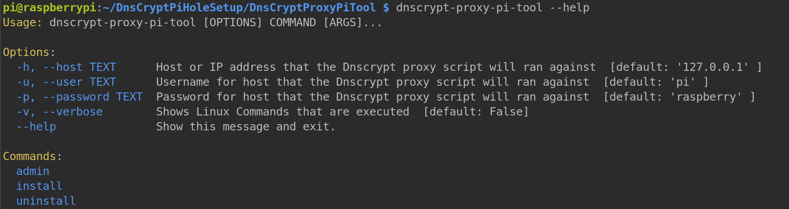
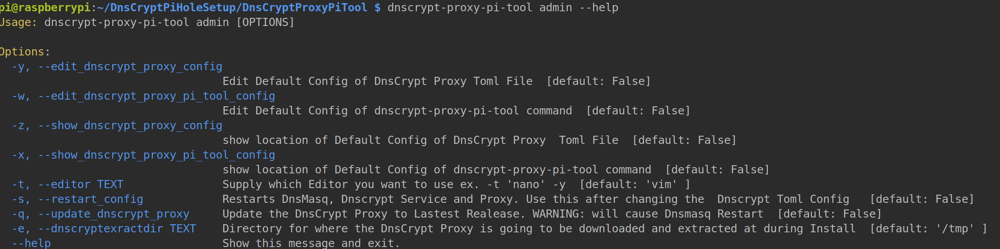

# DnsCryptProxyPiTool

DnsCryptProxyPiTool is a command line tool to set up [DnsCrypt Proxy 2](https://github.com/jedisct1/dnscrypt-proxy) on PiHole for Raspberry Pi 3.

This tool is meant to be a all in one solution to manage and build your DNS Crypt Proxy 2.

## Features

- Installs Dnscrypt Proxy 2 if it doesnt exist.
- Builds Socket and Service Files for your DNS Crypt Proxy. 
- Allow easy editing of the DnsCrypt Proxy 2 Toml File (Default Config).
- Backs up your  original PI Hole config during install and restores it if uninstall is executed.
- Update to the Latest Dnscrypt Proxy 2 easily.

### Getting Started

[View Getting Started Guide](GET_STARTED.MD)

#### Support OS Types
- Raspbian GNU/Linux 9 (stretch)

#### Support for 3.2 Pihole only until Bugs are fixed
- https://pi-hole.net/2018/02/14/pi-hole-v3-3-released-its-extra-special/
- https://discourse.pi-hole.net/t/how-do-i-revert-to-a-previous-version-of-pi-hole/7168
 
### Known Issues
- In the Pi Hole Web Gui it will show the loopback address ex. 127.0.10.1 as the Dns Crypt Proxy 2.
Currently does not verbosely show which DnsCrypt Service is being selected. I am working with the Upstream
package to see if this possible.
- The Editor works best with Vim and I've had issue with Nano working to save a file.

